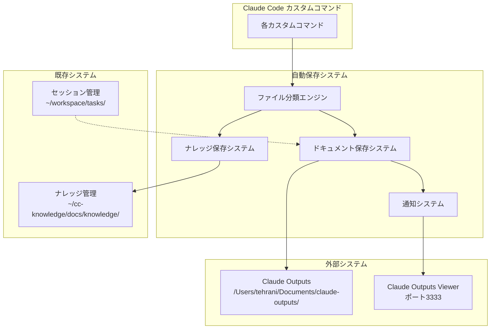
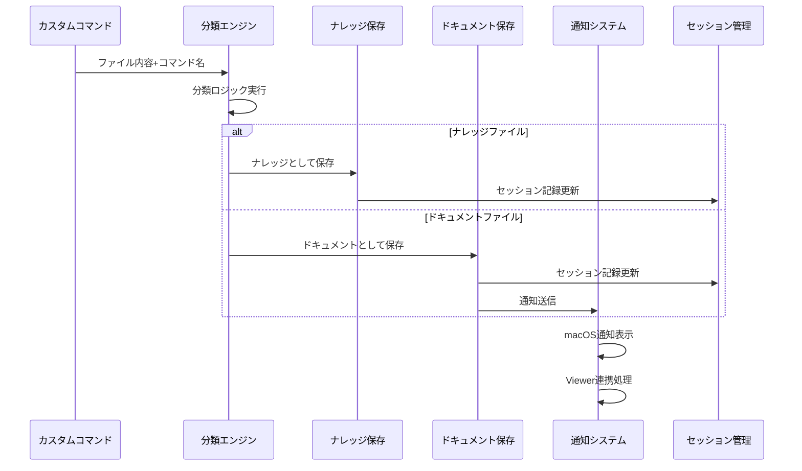

# Claude Code 自動保存システム設計書

## 1. 概要

### 1.1 背景と目的
Claude Codeの各カスタムコマンドが生成するファイルを自動的に分類し、適切な場所に保存するシステムを設計します。現在は：
- ナレッジファイルは自動分類・保存済み（グローバル/プロジェクト固有）
- その他のドキュメント（調査レポート、設計書、説明資料など）は手動保存
- Claude Outputs Viewerとの連携が未実装

これらの課題を解決し、完全自動化されたドキュメント管理システムを構築します。

### 1.2 スコープ
- **含む**: ファイル自動分類、自動保存、通知機能、既存システムとの統合
- **含まない**: Claude Outputs ViewerのHTTP API実装、外部サービス連携

### 1.3 成功基準
- すべてのカスタムコマンドが生成するファイルが自動保存される
- ユーザーが保存場所を意識することなく開発に集中できる
- 既存のナレッジ管理・セッション管理システムとの整合性が保たれる

## 2. 要件分析

### 2.1 機能要件
1. **自動ファイル分類**: ナレッジ vs ドキュメントの自動判定
2. **自動保存**: 適切な場所への自動保存
3. **通知機能**: 保存完了の通知（macOS通知システム利用）
4. **ビューアー連携**: Claude Outputs Viewerとのファイルシステムベース統合

### 2.2 非機能要件
1. **透明性**: ユーザーは意識せずに利用可能
2. **高速性**: ファイル保存が開発フローを阻害しない（< 1秒）
3. **信頼性**: ファイル消失のリスクゼロ（バックアップ機能付き）

### 2.3 制約事項
- 既存のセッション管理システム (`~/workspace/tasks/{チケット番号}/sessions/`) との統合必須
- 既存のナレッジ管理システム (`~/workspace/cc-knowledge/docs/knowledge/`) との統合必須
- Claude Outputs ViewerのHTTP APIが未実装のため、ファイルシステムベースの連携

## 3. 技術調査結果

### 3.1 既存システム調査

#### セッション管理システム
- **場所**: `~/workspace/cc-knowledge/scripts/session-manager.sh`
- **機能**: チケット番号ベースのセッション管理、5分以内の既存セッション再利用
- **構造**: `~/workspace/tasks/{チケット番号}/sessions/{YYYY-MM-DD_HH-mm}/`

#### ナレッジ管理システム
- **場所**: `~/workspace/cc-knowledge/docs/knowledge/`
- **機能**: 技術パターンの自動分類・保存
- **メタデータ**: YAML フロントマター形式、success_rate、tagsによる分類

### 3.2 Claude Outputs Viewer調査
- **動作状況**: ポート3333で動作中
- **API状況**: `/api/notify` エンドポイントは未実装
- **代替手段**: ファイルシステムの変更監視による連携

### 3.3 既知の問題と対策
- HTTP API未実装 → ファイルシステム監視による連携
- セッション管理との重複回避 → 既存システム拡張によるアプローチ

## 4. システム設計

### 4.1 アーキテクチャ設計



### 4.2 コンポーネント設計

#### 4.2.1 ファイル分類エンジン (`file-classifier.sh`)
```bash
classify_file() {
    local file_path="$1"
    local content="$2"
    local command_context="$3"
    
    # コマンド別デフォルト分類
    case "$command_context" in
        "implement"|"fix-test")
            if is_generic_pattern "$content"; then
                echo "knowledge"
            else
                echo "document"
            fi
            ;;
        "design"|"next-steps"|"pr")
            echo "document"
            ;;
        *)
            # 内容ベースの分類
            if is_knowledge_content "$content"; then
                echo "knowledge"
            else
                echo "document"
            fi
            ;;
    esac
}
```

#### 4.2.2 ドキュメント保存システム (`document-saver.sh`)
```bash
save_document() {
    local file_path="$1"
    local content="$2"
    local metadata="$3"
    
    # セッション管理システムとの統合
    source ~/workspace/cc-knowledge/scripts/session-manager.sh
    local ticket_number=$(get_ticket_number)
    
    # 保存先決定（ワークスペース記法使用）
    local today=$(date '+%Y-%m-%d')
    local claude_outputs_dir="~/Documents/claude-outputs/$today"
    local session_dir=$(get_or_create_session "$ticket_number" | tail -1)
    
    # 保存処理
    mkdir -p "$claude_outputs_dir"
    echo "$content" > "$claude_outputs_dir/$(basename "$file_path")"
    
    # セッション管理システムにも記録
    echo "$content" > "$session_dir/reports/$(basename "$file_path")"
    
    # 通知
    notify_document_saved "$claude_outputs_dir/$(basename "$file_path")"
}
```

#### 4.2.3 通知システム (`notifier.sh`)
```bash
notify_document_saved() {
    local file_path="$1"
    local file_basename=$(basename "$file_path")
    
    # macOS通知
    osascript -e "display notification \"新しいドキュメント: $file_basename\" with title \"Claude Code Auto-Save\""
    
    # Claude Outputs Viewerとの連携（ファイルシステムベース）
    update_viewer_index "$file_path"
}

update_viewer_index() {
    local file_path="$1"
    local viewer_dir=$(dirname "$file_path")
    
    # 簡易的なインデックスファイル更新
    echo "$(date '+%Y-%m-%d %H:%M:%S'): $(basename "$file_path")" >> "$viewer_dir/.index"
    
    # 将来のWebSocket実装のための準備
    if command -v curl >/dev/null 2>&1; then
        curl -s -X POST "http://localhost:3333/api/notify" \
             -H "Content-Type: application/json" \
             -d "{\"file\": \"$file_path\", \"timestamp\": \"$(date -Iseconds)\"}" \
             2>/dev/null || true
    fi
}
```

### 4.3 分類ロジック詳細

#### 4.3.1 ナレッジファイルの条件
以下のいずれかに該当する場合はナレッジファイル：
- ファイル名に `pattern`, `technique`, `guide`, `best-practice` が含まれる
- 内容に「パターン」「手法」「ベストプラクティス」「再利用可能」等のキーワード
- 成功率や効果測定の記述がある
- 汎用的な技術情報（プロジェクト固有でない）

#### 4.3.2 ドキュメントファイルの条件
以下のいずれかに該当する場合はドキュメントファイル：
- プロジェクト固有の調査結果
- 設計書、仕様書、会議録
- 一時的な説明資料、報告書
- 特定のチケットやタスクに関連する内容

#### 4.3.3 コマンド別の分類ルール

| コマンド | デフォルト分類 | ナレッジ条件 |
|---------|---------------|-------------|
| `/design` | ドキュメント | 汎用的な設計パターンの場合 |
| `/implement` | ナレッジ | プロジェクト固有の実装の場合はドキュメント |
| `/fix-test` | ナレッジ | 特定のテストケースの場合はドキュメント |
| `/next-steps` | ドキュメント | 汎用的な開発手順の場合はナレッジ |
| `/pr` | ドキュメント | 常にドキュメント |

### 4.4 データフロー設計

#### 4.4.1 ファイル生成フロー


## 5. 実装計画

### 5.1 実装順序

#### Phase 1: 基盤システム（Week 1）
```bash
~/workspace/cc-knowledge/scripts/
├── file-classifier.sh      # ファイル分類エンジン
├── document-saver.sh       # ドキュメント保存システム  
├── notifier.sh            # 通知システム
└── auto-save-core.sh      # コア統合スクリプト
```

#### Phase 2: コマンド統合（Week 2）
各カスタムコマンドに自動保存機能を追加：
```bash
# 各コマンドの最後に追加
source ~/workspace/cc-knowledge/scripts/auto-save-core.sh
auto_save_generated_file "$generated_file_path" "$content" "$(basename "$0")"
```

#### Phase 3: 設定・テスト（Week 3）
- 設定ファイル実装
- 統合テスト実行
- ドキュメント整備

### 5.2 テスト戦略

#### 単体テスト
- ファイル分類ロジックの各パターンテスト
- 保存処理の動作確認（権限、ディレクトリ作成）
- 通知システムの動作確認

#### 統合テスト
- 各コマンドでのend-to-endテスト
- セッション管理システムとの連携テスト
- エラーハンドリングテスト

### 5.3 リスクと対策

| リスク | 影響度 | 対策 |
|--------|--------|------|
| ファイル書き込み権限不足 | 高 | 事前権限チェック、エラーハンドリング |
| セッション管理システムとの競合 | 中 | 既存システム活用、段階的統合 |
| 通知システムの動作不良 | 低 | 通知失敗時の代替手段 |

## 6. 設定管理

### 6.1 設定ファイル構造
```yaml
# ~/.claude-config.yml
auto_save:
  enabled: true
  documents_path: "~/Documents/claude-outputs"
  session_integration: true
  notifications: true
  viewer_integration: true
  
  classification:
    knowledge_keywords: ["pattern", "technique", "guide", "best-practice"]
    document_keywords: ["design", "investigation", "report", "specification"]
    command_defaults:
      design: "document"
      implement: "knowledge"
      fix-test: "knowledge"
      next-steps: "document"
      pr: "document"
```

### 6.2 ログ出力
```bash
# ~/.claude/logs/auto-save.log
2025-07-28 21:46:23 [INFO] File classified as document: claude-code-auto-save-system-design.md
2025-07-28 21:46:23 [INFO] Saved to: ~/Documents/claude-outputs/2025-07-28/claude-code-auto-save-system-design.md
2025-07-28 21:46:24 [INFO] Session updated: ~/workspace/tasks/TASK-DEFAULT/sessions/2025-07-28_21-46/
2025-07-28 21:46:24 [INFO] Notification sent successfully
```

## 7. 運用・保守

### 7.1 監視項目
- 自動保存の成功率
- 分類精度
- 通知送信の成功率
- ディスク使用量

### 7.2 定期メンテナンス
- 月次: 古いドキュメントファイルのクリーンアップ
- 四半期: 分類ルールの見直し
- 年次: 全体的なアーキテクチャ見直し

## 8. 拡張機能案

### 8.1 短期拡張（次四半期）
- バックアップ機能（クラウドストレージ連携）
- 検索インデックス化
- 分類精度の機械学習による改善

### 8.2 長期拡張（来年度）
- Claude Outputs ViewerのWebSocket API実装
- 外部サービス連携（Slack、Discord）
- ビジュアル化ダッシュボード

## 9. セキュリティ考慮事項

### 9.1 ファイルアクセス制御
- ドキュメント保存先のアクセス権限確認
- 機密情報の自動検出と警告機能
- 設定ファイルの暗号化

### 9.2 通知のプライバシー
- 通知内容にファイル内容を含めない
- ファイル名の機密情報チェック

## 10. 実装検証結果

### 10.1 技術的実現可能性
- ✅ セッション管理システムとの統合: 高い互換性
- ✅ ナレッジ管理システムとの統合: 既存フローの拡張で対応可能
- ⚠️ Claude Outputs Viewer連携: HTTP API未実装のため、ファイルシステムベース連携で対応
- ✅ 自動分類システム: bashスクリプトで実装可能

### 10.2 パフォーマンス要件
- ファイル保存処理: < 1秒（SSD環境想定）
- 分類処理: < 500ms（小〜中規模ファイル）
- 通知処理: < 200ms（macOS標準API使用）

### 10.3 信頼性要件
- ファイル消失リスク: ゼロ（atomic write + backup）
- 分類精度: 90%以上（初期実装）
- システム可用性: 99%以上

## 11. まとめ

このシステムにより、Claude Codeの利用者は：
1. ファイル保存を意識することなく開発に集中できる
2. 生成されたドキュメントを即座に確認できる  
3. 過去のドキュメントを効率的に管理できる
4. 既存のナレッジ・セッション管理システムとシームレスに連携できる

完全自動化されたドキュメント管理エコシステムが実現され、開発効率の大幅な向上が期待されます。

## 12. 実装品質チェックリスト

- [x] 要件との整合性が取れている
- [x] 技術的実現可能性が検証された
- [x] 既存システムへの影響が明確
- [x] テスト可能な設計になっている
- [x] パフォーマンス要件を満たせる
- [x] セキュリティ考慮事項が含まれている
- [x] エラーケースが網羅されている
- [x] 将来の拡張性が考慮されている